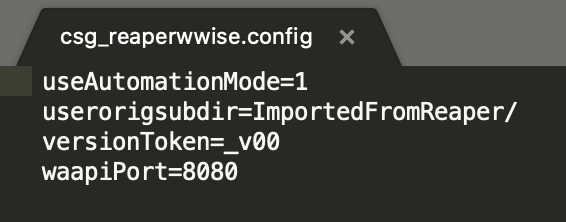

# Configuration and Setup

The plugin uses a config file to define some default values for features, as well as provide a way for the user to customise those features. If a config file isn't found next to the plugin when it launches, it will create one using the default values. This file can then be edited by the user to override certain configuration options.

### Configuration File and Option;

  
 Configuration File and Options 

   
  -<strong> The config file is a basic text format file, loaded or created by the plugin on startup. The config file can be found next to the plugin location within the Reaper resource path. </strong>  
    
   
  -<strong> useAutomationMode</strong>  
  Wwise can operate in an automation mode where certain UI elements are supressed. This option enables (1) or disables (0) automation mode when creating or importing in Wwise. Default value is 1 (enabled).  
   
  -<strong> userorigsubdir</strong>  
  This is a default path for importing audio into the Wwise Originals folder. This string is a path relative to the Originals/SFX or Originals/Voices/[Language] folder. It will be set as the default text in the Transfer plugin originals directoy input. Default value is "ImportedFromReaper/".  
   
  -<strong> versionToken</strong>  
  This is the string token/pattern used to determine if an audio file to be imported is a "version", and as such should be imported as a new source instead of updating the existing wav file. This string describes the alpha numeric version pattern to use. Default value is "_v00".  
   
  -<strong> waapiPort</strong>  
  This is the WAMP port to use to connect to Wwise. This should match the port value set in the Wwise authoring tool user preferences. Default value is 8080.  
   

****

### Wwise Connection and Status;

  
 Wwise Connection and Status 

   
  -<strong> When the plugin launches, it tries to connect to a Wwise project via Waapi. You must ensure that Waapi is enabled in the Wwise authoring tool </strong>  
  Take note of the WAMP port you are using. 8080 is the default for the plugin, but it can be changed in the plugin config file  
    
   
  -<strong> If the plugin has a connection, it will display the status and name of the Wwise project at the bottom</strong>  
  If the connection is lost, the Connect To Wwise button allows you to try and re-establish a connection 
    
   
    -<strong> If the plugin cannot make a connection, it will display a no connection warning</strong>  
  The most likely cause of this is a mismatch in the ports being used by Wwise and the plugin 
    
   

****
