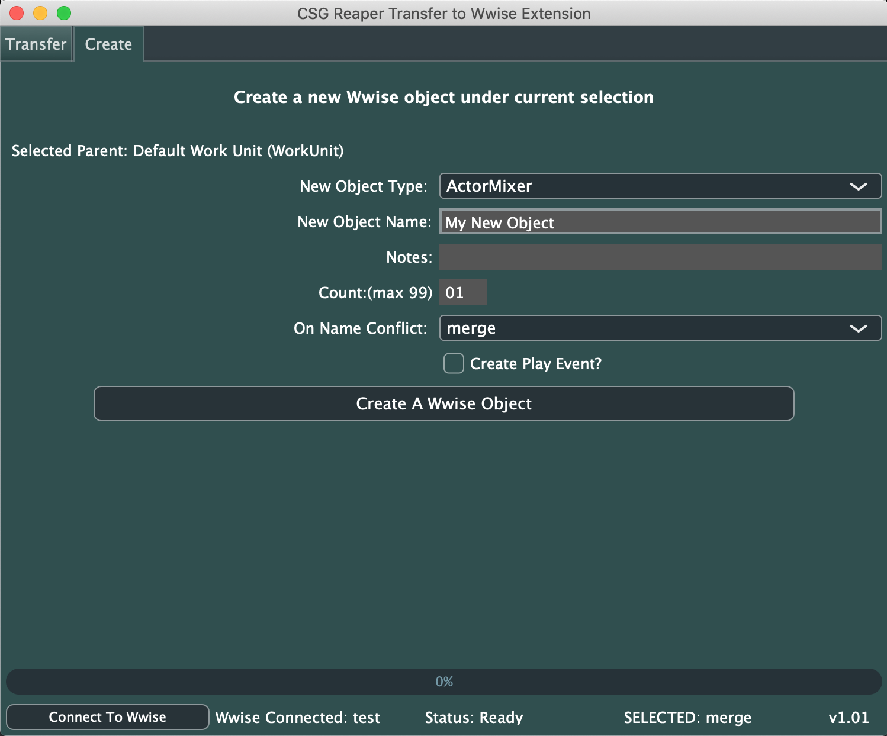

###### [Home](../../index.md)
## Create Window

This window allows for quick creation of several Wwise structural objects.
It uses Waapi to communicate with the Wwise authoring tool, so depends on having the Wwise project open and Waapi configured.  

The title summarises the basic idea of this plugin window.  
  

### The basic workflow for using the plugin is;

  
 Workflow 

 
  1. In Wwise, select the existing object you want to be the parent of your new objects  
    
   
  2. Choose the type of object you want to create, and fill out any additional properties 
  You can specify a name and notes, as well as choose what to do if there is a name conflict with an    existing wwise object. You can also create an event for your new object.
    
   
  3. Press the Create Wwise Object button to create a new object, using the properties you defined, underneath the currently selected Wwise object  

****

### Creating Multiple Objects At Once;

  
 Creating Multiple Objects 

     
  -<strong> The Count property allows you to create multiple objects in one go </strong>  
  Setting the count to something greater than 1 will trigger this behaviour. 
    
   
  -<strong> When this mode is active, the name conflict behaviour is changed to Rename</strong>  
  This allows Wwise to handle the incrementing of the object names. 
    
   

****

### Wwise Connection and Status;

  
 Wwise Connection and Status 

   
  -<strong> When the plugin launches, it tries to connect to a Wwise project via Waapi. You must ensure that Waapi is enabled in the Wwise authoring tool </strong>  
  Take note of the WAMP port you are using. 8080 is the default for the plugin, but it can be changed in the plugin config file  
    
   
  -<strong> If the plugin has a connection, it will display the status and name of the Wwise project at the bottom</strong>  
  If the connection is lost, the Connect To Wwise button allows you to try and re-establish a connection 
    
   
    -<strong> If the plugin cannot make a connection, it will display a no connection warning</strong>  
  The most likely cause of this is a mismatch in the ports being used by Wwise and the plugin 
    
   

****
