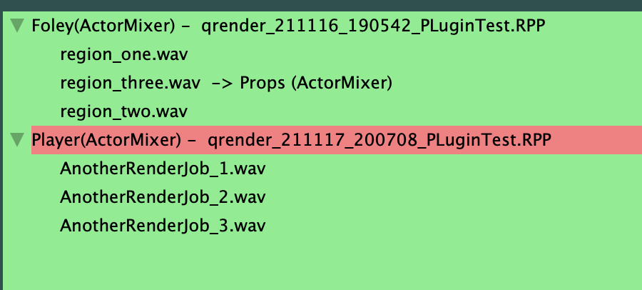

###### [Home](../../index.md)
## Transfer Window

This window uses the Reaper render queue to automate importing audio into Wwise.
It uses Waapi to communicate with the Wwise authoring tool, so depends on having the Wwise project open and Waapi configured.  

The title summarises the basic idea of this plugin window.  
  

### The basic workflow for using the plugin is;

  
 Workflow 

 
  1. In Reaper, instead of directly rendering your audio files, add them to the render queue  
    
   
  2. The plugin will show the render job and the resulting files in the main window  
    
   
  3. The top section of the plugin is where you set and apply the import properties for the render queue jobs  
    
   
  4. Once you have set the properties, ensure you have the desired parent selected in Wwise, then select the desired job and hit Apply  
    
   
  5. Once all jobs have their import properties set, you are ready to Render and Import  
    
  This will start Reaper rendering, and when the render is finished the plugin will import the resulting files into Wwise using the import settings  

****

### Setting the import properties;

  
 Import Properties 

   
  <strong> - At the top of the window, the plugin will show the currently selected Wwise object. </strong>  
  This will update when the selection changes in Wwise.  
    
   
 - <strong>Choose to import the audio files as sound fx, voice or music tracks. When voice is selected a project language drop-down is enabled </strong>  
    
   
 - <strong>Choose to create events for the imported items </strong>  
    Play@Children will create a Play event for each audio file in the list when it is imported  
    Play@Parent will create a Play event for the parent object of the imported files. For example, if you are importing variations into a random container  
    
     
 - <strong>Choose the location in Originals to copy the audio files into </strong>  
  Originals dir matches Wwise - This will create a folder structure matching the Actor-Mixer structure where the audio is imported (can result is fairly deep nesting as it mirrors the AM structure fully)  
  Otherwise the user can either enter the text path, relative to the SFX/Voices root, or use the system directory selector  
    
    
 -<strong> Refresh the list of render jobs and files in the plugin window </strong>  
    
   
 -<strong> The status bar shows and errors, as well as the current Wwise connection. </strong>  
  There is also a button to refresh the connection to Wwise in cases where the plugin was open without Wwise open, or the Wwise tool was closed while the plugin was in use.  
    
   
  

****

### Render jobs and per file overrides;

  
 Render Job and File Overrides 

   
   -<strong> The central view of the plugin shows the list of jobs in the render queue, and the files that will be created from them </strong>  
  The list is automatically populated when the plugin is opened  
    
   
  -<strong> If the render queue changes, you can refresh the list of jobs and files with the Refresh button </strong>  
  Refreshing the list will clear any applied properties  
    
   
   -<strong> Applying properties to the job itself means all the files in that job will use the same properties </strong>  
  It is possible to override individual files in the job with different properties by selecting the file instead of the job when applying  
    
   
  -<strong> It is possible to have multiple jobs in the render queue, and the plugin will display multiple jobs in the list </strong>  
  This is useful for cases where you want to export batches of audio with different render settings, or render from multiple projects  
    
   
  

****

### Wwise Connection and Status;

  
 Wwise Connection and Status 

   
  -<strong> It is possible to have multiple jobs in the render queue, and the plugin will display multiple jobs in the list </strong>  
  This is useful for cases where you want to export batches of audio with different render settings, or render from multiple projects  
    
   

****

### Version Handling and Existing Files;

  
 Version Handling and Existing Files 

  

****
